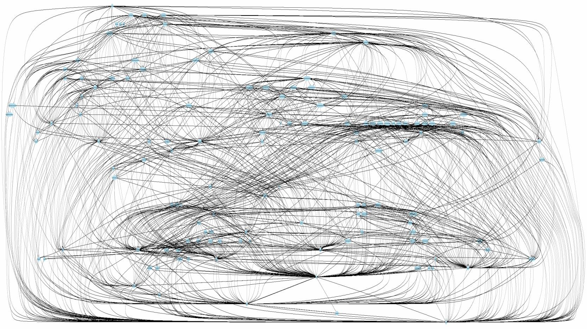
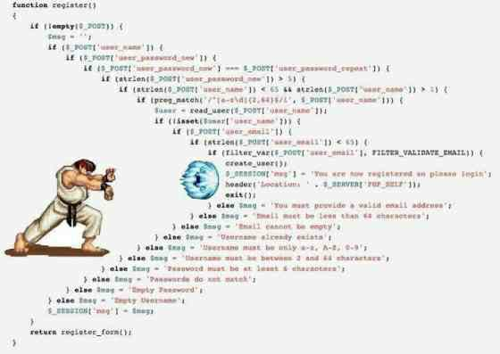

# 代码中常见的问题

不好的味道太多,  我这里只总结了自己在各个项目中碰到的写代码中出现频次很高的一些问题.
这里面有些是个人可以规避的,  有些需要靠团队共同努力。

## 硬编码

- 不愿意写枚举/用常量
- '04', '04', '04': 我喜欢这个数字, 没人知道这个数字的秘密

## 全局变量

- 临时图省事, 维护泪两行

## 没有边界

- 不分上下文/层级, 模块间随意互相调用, 交叉污染
- 一个功能的代码可以分散到世界的各个角落
- 本来只需要依赖几个模块, 结果引用一大堆

所谓架构师, 就是一个很会拆的人。

## 过程式编程

- 企图用一个函数解决所有问题, 动辄几百行
- 拆分是不可能的, 这辈子都不会拆的
- 面向对象语言愣是写出C语言的范来

## 异常处理缺失或者混乱

- 从不验证外源数据
- 不管异常
- 不打日志
- 日志不写上下文

## 复制粘贴

- 复制自己: 1, 2, 3, 跑起来了!
- 复制别人: 完全不用理解代码, 就可以'高效'的编程了
- 从不封装: 调用者需要知道被调用的所有的细节

## 大量条件嵌套

- 里三圈, 外三圈, 脖子扭扭, 屁股扭扭...

## 长代码行

- 有助于治疗鼠标手: 别人阅读的时候需要来来回回的拖

## 随意的命名

- 抽象到跟没说一样  
- 没有人能根据我的关键字搜索

## 注释

- 写了完全没用, 除了碍眼
- 不注释机关陷阱
- 假注释: 改代码但是不改注释

## 无用的代码

- git history 的存在是有意义的
- 你的代码没有想象中那么值钱

## 没有代码保护

- 任何外部模块都可以随意访问和修改, 你在写公用库/API时尤其要重视这一点

## 参数个数巨多的函数

- 修改和调用都将是噩梦
- 写单元测试将是一项无法完成的工作

## 参数结构不写清楚(弱类型语言通病)

- 靠人肉在线推导类型
- ts不写类型, 关键地方 any

## 没有一致性

- 同样的对象在A模块叫c, 在B模块叫d

**总结一句话: 没有设计和架构的概念, 低内聚, 高耦合, 用复杂的代码解决简单的问题**, 说句实话, 前端在这块普遍意识薄弱一些
