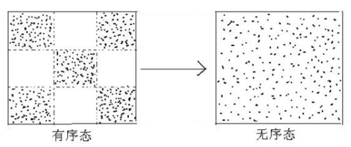
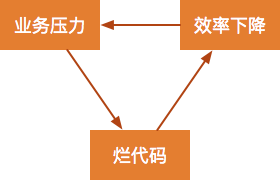
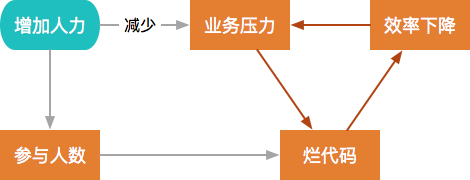
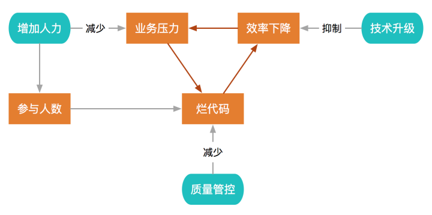
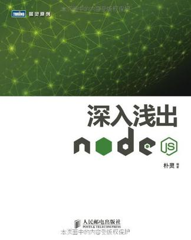
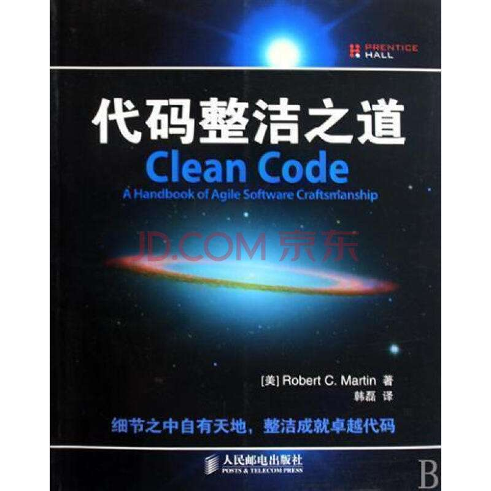
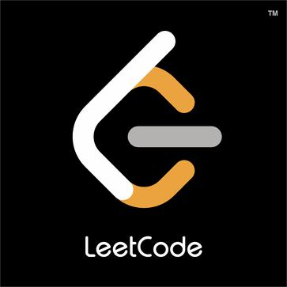
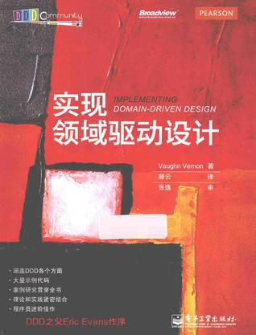

# 背景

这次的主题是代码质量, 其实不太知道该从何说起, 重点讲什么, 如何讲。编码指导规范, 错误/整洁代码示例, 原则, 设计模式, 领域模型什么的, 要么网上都有现成的, 要么知识点太多, 对于这么一次短时间的分享来说没啥意义，网上关于代码质量的文章也是大把。所以这次我只想结合自身的经历, 聊一聊感想，只说自己想说的那部分: 仅代表个人观点, 由于自身局限性，偏见在所难免, 欢迎大家纠正和补缺。

## 首先, 前端/后端工作的难点在哪里?

- 不同阶段, 不同项目, 遇到的难点会不断变化

### 初期: 技术难点

- 其实不是真的很难(大部分)
- 再难也有攻克的一天
- 大部分时间其实没什么技术难点
- 点状

### 初中期

- 纯靠个人技术成长收益最高的时期
- 要分清知识和工具的区别

## 中后期: 项目难点

- 高扩展性/可维护性
- 快速迭代
- 高自动化
- 工程复杂, 面状

## 中后期: 人的难点

- 沟通/协作
- 跨部门沟通/协作
- 业务理解

### **程序的目的是要解决现实中的问题, 最终还是人的问题**

## 前端的难点在哪

- 数据 + UI + 交互: 状态管理复杂, 变更频繁，难抽象
- 垂直领域解决方案各不相同, 分析、设计、开发、落地难, 重用度低
- 个人成长: 不稳定的环境容易让人迷失方向

## 后端的难点在哪

- 高稳定性
- 高安全性
- 高伸缩性

## 职业生涯

- 持续学习总结
- 做很多项目: 开荒的, 重构的, 接手维护的
- 接触不同的人, 不同的团队
- 面临很多挑战

### **其实我想说的是, 高质量代码也是重要难点之一, 且全方位贯穿始终, 是基石。代码质量体现了很多问题。**

#### 框架, 某项技术, 知识点, 可以短时间学习并投入使用
#### 而代码质量不能, 需要长时间有意识的学习训练和提高

### 在日常工作中, 无论在何种阶段, 何种境遇, 做什么项目, 面临何种挑战, 代码质量将是贯穿始终不得不面对的一环。

# 什么是代码质量

> 代码质量指的是代码内在的非功能性的质量，用户不能直接体验到这种质量的好坏，代码质量不好，最直接的“受害者”**是开发者或组织自身**.

# 为什么需要好的代码质量

## 背景: 熵增定律

> 在无外力影响的情况下，烂代码只会原来越多。

> 为了维持系统有序，需要外界向系统不断输入能量

## 从组织/团体角度上讲

> 烂代码产生的常见原因是业务压力大，导致没有时间或意愿讲究代码质量。因为向业务压力妥协而生产烂代码之后，开发效率会随之下降，导致业务压力更大，形成一种典型的恶性循环。

> 为了应对业务压力，常见的做法就是向项目中增加人力，但是单纯地增加人力的话，会因为风格不一致、沟通成本上升等原因导致烂代码更多。

> 要遏制这种恶性循环，需要多管齐下，主动对代码质量进行管控，并且持续进行技术升级，系统性地解决问题。

现实中实际上很多情况是这样: 质量不够, 人力来凑。
这招确实有效, 毕竟初期要抢占市场, 必须要快, 毕竟有些项目总共也存活不了多长时间。

然而人力只能在一定程度上解决问题。
人力是有限的，也不太可能在短时间内爆发, 而业务的发展就不受控制了。

当人力增加跟不上业务发展的时候，就不是一个好坏的问题了, 是无和有的问题。这个时条件允许的话只能重构/推倒重来, 否则积重难返, 项目就回天乏术了。

每个项目都有自己的生命周期, 烂代码越多, 越离崩解不远了。

有人会说靠更新架构支撑业务发展, 这个当然没错, 然而这建立在良性循环、条件、成本之上, 并不是万能的。

## 从个人角度上讲

- 好的代码, 容易理解/掌握, 情绪可以保持稳定

- 好的代码, 容易修改/扩展, 效率高, 少加班

- 好的代码, 容易定位bug, 故障少, 少挨喷

- 好的代码, 让人信赖, 更有机会负责更大的事

总结: 保命保平安, 有前途

我之前曾经接手一个IM项目, 当时的情景是这样:

- 1 开发新功能困难, 进度慢, 不能支撑业务发展
- 2 四处冒烟, 出了bug难定位, 很多蜜汁bug
- 3 开发本人都不清楚自己写过的功能都有啥逻辑
- 4 完美的实践了怎么写出无法维护代码的准则

最后没有办法, 只能抽丝剥茧, 一块块拆, 重新设计和重构, 耗费了大量成本填补技术债务，那就是另外一个关于如何重构的故事了。

# 代码中常见的问题

不好的味道太多,  我这里只总结了自己在各个项目中碰到的写代码中出现频次很高的一些问题.
这里面有些是个人可以规避的,  有些需要靠团队共同努力。

## 硬编码

- 不愿意写枚举/用常量
- '04', '04', '04': 我喜欢这个数字, 没人知道这个数字的秘密

## 全局变量

- 临时图省事, 维护泪两行

## 没有边界

- 不分上下文/层级, 模块间随意互相调用, 交叉污染
- 一个功能的代码可以分散到世界的各个角落
- 本来只需要依赖几个模块, 结果引用一大堆

## 过程式编程

- 企图用一个函数解决所有问题, 动辄几百行
- 拆分是不可能的, 这辈子都不会拆的
- 面向对象语言愣是写出C语言的范来

## 异常处理缺失或者混乱

- 从不验证
- 不管异常
- 不打日志
- 日志不写上下文

## 复制粘贴

- 复制自己: 1, 2, 3, 跑起来了!
- 复制别人: 完全不用理解代码, 就可以'高效'的编程了
- 从不封装: 调用者需要知道被调用的所有的细节

## 大量条件嵌套

- 里三圈, 外三圈, 脖子扭扭, 屁股扭扭...

## 长代码行

- 有助于治疗鼠标手: 别人阅读的时候需要来来回回的拖

## 随意的命名

- 抽象到跟没说一样  
- 没有人能根据我的关键字搜索

## 注释

- 写了完全没用, 除了碍眼
- 不注释机关陷阱
- 假注释: 改代码但是不改注释
- 理解你的心情, 但是不要再写f*ck了

## 无用的代码

- git history 的存在是有意义的
- 你的代码没有想象中那么值钱

## 没有代码保护

- 任何外部模块都可以随意访问和修改

## 参数个数巨多的函数

- 修改和调用都将是噩梦
- 写单元测试将是一项无法完成的工作

## 参数结构不写清楚(弱类型语言通病)

- 靠人肉在线推导类型
- ts不写类型, 关键地方 any

## 没有一致性

- 同样的对象在A模块叫c, 在B模块叫d

**总结一句话: 没有设计和架构的概念, 低内聚, 高耦合, 用复杂的代码解决简单的问题**, 说句实话, 前端在这块普遍意识薄弱一些

# 工作中你可能遇到的问题

## 代码质量和工作效率怎么平衡

- 立项初期, 团队不成熟的时候, 两者成反比
- 项目中后期, 团队成熟后, 两者成正比
- 无论何种时期, 代码质量有要有一个下限
- 一次性代码就随便了, 这种应该自动化

## 如何看待宁可拷贝大段代码也不调整/优化原有代码的行为

### 改: 

- 可能带来大量的修改点和工作量
- 可能对些奇怪的点理解错误，导致已正常运行的功能出错(单元测试是个好东西)
- 高风险

### 不改:

- 代码负债增加
- 影响心情
- 破窗效应
- 传染性

### 问题:

- 值不值?

### 基本原则:

- 不能出错
- 按时交付
- 遵守团队规范

## 想重构怎么办

### 重构不是推倒重写

- 要理解清楚现有业务逻辑
- 在不改变现有功能表现的前提下做内部优化
- 不能丢失细节

### 重构要做好CI防护: 兜底

- 要做好测试, 保证现有功能不受影响

### 重构是要针对性的解决问题

- 要有明确的目标, 有关键性的问题要解决
- 不是用一坨烂代码替换另一坨烂代码

### 重构是一个持续的过程

- 小步慢跑, 细水长流
- 贵在坚持

### 重构不是憋大招

- 不是憋个一年半载搞爆破

## Code Review 难落地怎么办, 总是不了了之

# 关于Code Review

> Code Review不只是一种方法，也是开发者特有的沟通方式，更是一种团队文化。

## Code Review的意义

 >- 交叉排查缺陷 - 绝大多数BUG都可以在代码层面被发现，甚至测试难以覆盖到的深层次BUG也可以通过团队成员相互审核而避免
 >- 提高代码质量 - Code Review意味着开发者要接受团队成员的建议与监督，在完成功能的基础之上不断完善代码结构
 >- 加强团队协作 - 团队成员在相互督促与改进中共同成长

国外一流的公司都是有完备的Code Review流程的, 国内只要把这块能做起来的, 随便就可以拿出来吹一吹了

## 有这些好处, 为啥 Code Review 还是难执行?

我本人这方面也遇到过不少问题, 也有很多困扰.
大致是这几种:

- 不能被看到直接产出
- 不能提升绩效
- 代码变更频繁投入时间review没意义
- 进行review的人还要花精力了解对应的功能需求, 耗费时间
- 代码不规范, 太多无意义review
- commit方式不规范: 让review变得困难

总结一句话: 总是投入没有回报的事让人坚持真的是强人所难。

所以得想个办法，因地制宜，讲究个方式。

## 措施

- 做需求前先讨论, 定好方案, 定好后方案要持久化
- 提交规范要落地(standard-version): 一个commit对应一个需求, 杜绝一次提交夹带无关联改动或者几个需求一次提交的情况。
- 代码规范(clean-code-typescript + ts-lint + sonar): 自动化流程解决规范不统一和基础质量问题, 不过自动检查的代码不得合并, 进不到code review这一步， 能自动的就不要人肉。
- 到了code review这一步，主要关心代码有没有按照既定方案实现, 有没有明显的bug, 代码组织有没有改善空间?
- 重点代码: 每个迭代/双周/月度对具有代表性的代码集体评审，重点在于解决团队共性问题，讨论改进方法
- 新人重点review
  
## 意识

>- 代码是团队共有的知识财富，而不是个人的私有地
>- 所有人对所有代码的最终质量负责，而非某个人对某些代码负责
>- 完成功能只是开始，代码需要持续改进以符合团队标准
>- Code Review对于团队中的新人来说是很好的锻炼机会

## 注意事项

>- Code Review不能形式化，没看过PR、没改进意见不能通过
>- PR被打回不是丢面子的事情，被提改进建议也不是批评，对事不对人
>- 将别人提交的代码视作自己将维护的代码，个人标准与集体标准对齐

## 总结

> Code Review体现的是团队对于代码质量的追求，对于团队内部协作的重视。对于新手来讲，对于日常工作的钻研与打磨比偶尔一次的技术培训或分享更有学习价值。

# 如何提高代码质量

## 基本原则

- 代码不是私人的, 是公共财产
- 程序员大部分时间是在阅读代码
- 写代码要保证可读性, 尽量降低思维负担

## 扎实基础

- 对语言特性的理解
- 专业背景知识的掌握
- 数据结构和算法
- 设计模式和原则

下面是个人觉得实用的入门资料:

## 模仿优秀的代码

## 再忙, 停下来, 多总结, 多思考

## 代码标准

- [clean-code-typescript](https://github.com/labs42io/clean-code-typescript)

## 强类型检测(针对动态语言)

- typescript

## 自动检测

- 代码规范检查 - 包括风格规范、实践规范、业务规范
- 重复率 - 重复出现的代码区块占比，通常要求在5%以下
- 复杂度 - 总行数，模块大小，循环复杂度等
- 检查覆盖度 - 经过检查的行数占代码库总行数的比例
- tslint + sonar + jenkins

## 想好再写

## 善用开源

## 持续重构

## 代码审查

## 单元测试

## 充分自测

## 技术升级

## 流程标准

- git flow·改

# 进阶

## 自我保护能力

## 伸缩能力

## 资源限制

## 详细的日志

# 嵌套, 多维数组, 循环请求

- key: getInsuranceInfoFromInner

# 300， 500, 600行函数, 硬编码, 多重嵌套

- key: getScheduleList
- key: getSchedule
- key: aggregationAll
- key: addProTaskBasicForSix

# 无用代码

- key: CmaScheduleService
- key: CreditService
- key: CheckRecordService
- key: const autoDecision 

# 重复

- key: CommonService

